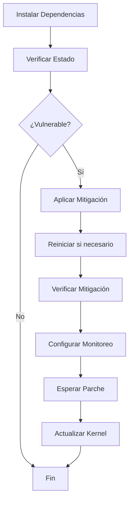

# CVE-2026-31431 "Copy Fail" - Suite de Verificación y Mitigación

Suite completa de scripts Python para **verificar, mitigar y actualizar** sistemas Linux vulnerables a **CVE-2026-31431 (Copy Fail)**, una vulnerabilidad crítica de escalación de privilegios local en el kernel Linux.

---

## 🚨 Inicio Rápido (5 minutos)

```bash
# 1. Instalar dependencias
pip install boto3 paramiko

# 2. Verificar tus servidores
python3 check_ssh.py --hosts hosts.txt --key ~/.ssh/id_rsa

# 3. Aplicar mitigación automática
./quick_mitigate.sh
```

---

## 📋 Tabla de Contenidos

### 📖 Documentación Principal

1. **[Sobre la Vulnerabilidad](docs/VULNERABILIDAD.md)** - Detalles técnicos de CVE-2026-31431
2. **[Instalación](docs/INSTALACION.md)** - Requisitos y configuración inicial
3. **[Estructura del Proyecto](docs/ESTRUCTURA.md)** - Organización de archivos y scripts

### 🔍 Guías de Uso

4. **[Scripts de Verificación](docs/VERIFICACION.md)** - Cómo verificar si eres vulnerable
5. **[Scripts de Mitigación](docs/MITIGACION.md)** - Cómo aplicar mitigación inmediata
6. **[Scripts de Actualización](docs/ACTUALIZACION.md)** - Cómo actualizar el kernel
7. **[Automatización](docs/AUTOMATIZACION.md)** - Scripts automáticos y monitoreo

### 📚 Información Adicional

8. **[Interpretación de Resultados](docs/RESULTADOS.md)** - Entender la salida de los scripts
9. **[Mitigación Manual](docs/MANUAL.md)** - Comandos manuales por distribución
10. **[Integración CI/CD](docs/CICD.md)** - Integrar en pipelines
11. **[Preguntas Frecuentes](docs/FAQ.md)** - Respuestas a dudas comunes
12. **[Referencias](docs/REFERENCIAS.md)** - Enlaces y recursos externos

---

## 🎯 Flujo de Trabajo Recomendado



---

## 🚀 Comandos Esenciales

### Verificación
```bash
# Local
python3 check_local.py

# SSH
python3 check_ssh.py --hosts hosts.txt --key ~/.ssh/id_rsa

# AWS EC2
python3 check_ec2.py --region us-east-1
```

### Mitigación
```bash
# Automático (recomendado)
./quick_mitigate.sh

# Manual SSH
python3 mitigate_ssh.py --hosts hosts.txt --key ~/.ssh/id_rsa

# Manual EC2
python3 mitigate_ec2.py --region us-east-1 --auto-reboot
```

### Actualización
```bash
# Verificar si hay actualizaciones
python3 update_kernel_ssh.py --hosts hosts.txt --key ~/.ssh/id_rsa --check-only

# Aplicar actualizaciones
python3 update_kernel_ssh.py --hosts hosts.txt --key ~/.ssh/id_rsa
```

---

## 📊 Estado de la Vulnerabilidad

| Campo | Detalle |
|-------|---------|
| **CVE** | CVE-2026-31431 |
| **Nombre** | Copy Fail |
| **CVSS** | 7.8 (HIGH) |
| **Tipo** | Local Privilege Escalation |
| **Kernels vulnerables** | 4.14 hasta 6.18.21, 6.19.11, y anteriores a 7.0 |
| **Exploit público** | Sí (100% confiable) |

Ver [detalles completos](docs/VULNERABILIDAD.md).

---

## 🛠️ Scripts Disponibles

### Verificación
- `check_local.py` - Equipo local
- `check_ec2.py` - Instancias EC2
- `check_eks.py` - Nodos EKS
- `check_ecs.py` - Instancias ECS
- `check_ssh.py` - Hosts remotos SSH
- `check_all.py` - Verificación unificada

### Mitigación y Actualización
- `mitigate_ec2.py` - Mitigación EC2
- `mitigate_ssh.py` - Mitigación SSH
- `update_kernel_ec2.py` - Actualización EC2
- `update_kernel_ssh.py` - Actualización SSH
- `monitor_updates.py` - Monitor de actualizaciones

### Automatización
- `quick_mitigate.sh` - Script todo-en-uno
- `ci_cd_example.sh` - Ejemplo CI/CD
- `test_setup.sh` - Verificar configuración

Ver [estructura completa](docs/ESTRUCTURA.md).

---

## 📞 Soporte y Contribuciones

- **Documentación**: Ver carpeta `docs/`
- **Issues**: Reportar problemas en el repositorio
- **Contribuciones**: Pull requests bienvenidos

---

## 📄 Licencia

Uso libre. Creado como herramienta de respuesta a incidentes para CVE-2026-31431.

---

## ⚡ Enlaces Rápidos

- 🔴 [¿Soy vulnerable?](docs/VERIFICACION.md)
- 🛡️ [¿Cómo me protejo?](docs/MITIGACION.md)
- 🔄 [¿Cómo actualizo?](docs/ACTUALIZACION.md)
- ❓ [Preguntas frecuentes](docs/FAQ.md)
